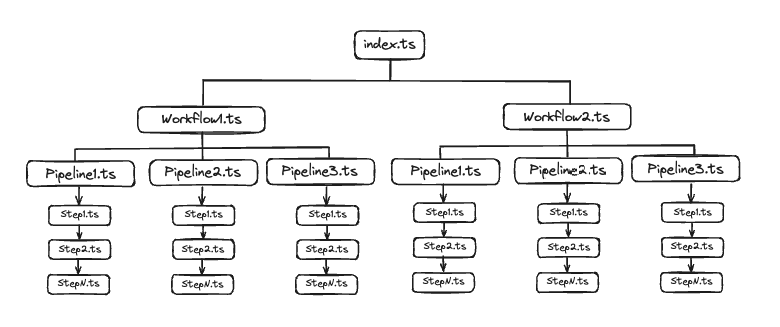

<h1 align="center">
    
</h1>
<p align="center">
🇧🇷 Arquitetura de <i>Workflow</i> para executar seus scripts sequencialmente ou paralelo em NodeJS.</br>
🇺🇸 <i>Workflow Architecture</i> to run your scripts sequentially or parallel in NodeJS. <a>English Readme here</a>
</p>
<hr>

### Objetivo

O objetivo geral dessa arquitetura é contemplar a necessidade de execução de scripts de forma controlada. Pode ser utilizada em diversos tipos de cenários e necessidades como por exemplo em aplicações _event driven_, _crawlers_, _scraping_, _crons_ entre outras. A _Workflow Architecture_ atende muito bem necessidades de aplicações de comunicação assíncrona.

### Recursos

Abaixo estão listados os recursos presentes na arquitetura:

- **Workflows**: São a maior unidade da arquitetura, contém a lógica e controle de execução das _pipelines_. Os workflows são a camada de entrada para execução dos demais unidades. São responsáveis também por enviar para as camadas filhas os dados a serem processados pelos _steps_.
- **Pipelines**: Tem comportamento semelhante aos _workflows_, porém tem a responsabilidade de decidir a forma e ordem (se aplicável) dos _steps_. Podem ser de dois tipos: `Sequential` e `Parallel`.
  - **SequentialPipeline**: São pipelines que executam os _steps_ em sequência, ou seja, um por vez, e seguindo uma ordem.
  - **ParallelPipeline**: São pipelines que executam os _steps_ de forma paralela, ou seja, sem uma sequência ou ordem. São indicados quando um _step_ não há dependencia de execução entre outro.
- **Steps**: São a menor unidade da arquitetura. Eles são responsável por interagir com o dado enviado e realizar as ações necessárias do script. Podem ser comparados aos _UseCases_ de outras arquiteturas.
- **GlobalContext**: É uma variável global mutável que pode receber qualquer tipo de dado. Sendo assim se torna o contexto da aplicação, e pode ser acessada e modificada pelos steps de acordo com a necessidade.



### Inspiração

Arquiteturas no geral, não são construidas ou criadas sem nenhuma motivação. Em sua maioria, elas evoluem de arquiteturas já existentes ou até mesmo são um complemento, como por exemplo o `MVC (Model View Controller)` e `MVVM (Model View ViewModel)`. Já a _Workflow Architecture_ é inspirada no funcionamento do Github Actions. Onde se tem vários arquivos de workflows, e dentro desses workflows você tem uma (ou várias) pipelines para serem executadas. E cada pipeline tem seus steps, que são literalmente etapas a serem executadas para a finalização do script. Assim temos uma abstração desse sistema em formato de arquitetura que pode ser utilizado em projetos não só em NodeJS, mas em qualquer linguagem.

### Estrutura de pastas

```bash
.
├── index.js # Arquivo de entrada
└── src
    ├── core # Camada principal da aplicação, onde se encontra as classes principais
    │   ├── ParallelPipeline.js
    │   ├── Pipeline.js
    │   ├── SequentialPipeline.js
    │   ├── Step.js
    │   └── Workflow.js
    ├── pipelines
    │   └── # Aqui conter suas pipelines
    ├── steps
    │   └── # Aqui conter seus steps. (Você também pode separá-los por pastas)
    │
    └── workflows
        └── # Aqui conter seus workflows
```

### Exemplo

Para exemplificar a utilização da arquitetura, abaixo temos a implementação de um script básico que roda as pipelines em sequencia, e adiciona um `console.log()` a cada step executado.<br/>

O primeiro passo é criar nossos steps, neste exemplo, eles só vão receber o dado de contexto global da aplicação e mostra-lo no console.<br/><br/>

`src/steps/ExampleStep1.ts`

```javascript:
import Step from "core/Step";

export default class ExampleStep1 extends Step {
  async run(context: GlobalContext): Promise<GlobalContext> {
    // Your code here
    console.log("Step1 running");
    return context;
  }
}
```

`src/steps/ExampleStep2.ts`

```javascript:
import Step from "core/Step";

export default class ExampleStep2 extends Step {
  async run(context: GlobalContext): Promise<GlobalContext> {
    // Your code here
    console.log("Step2 running");
    return context;
  }
}
```

O segundo passo é criar a nossa pipeline, nesse caso vamos utilizar uma pipeline sequencial pois não precisamos que os nossos steps sejam executados de forma paralela.<br/><br/>

`src/pipelines/ExamplePipeline.ts`

```javascript:
import SequentialPipeline from "core/SequentialPipeline";
import ExampleStep1 from "steps/ExampleStep1";
import ExampleStep2 from "steps/ExampleStep2";

export default class ExamplePipeline extends SequentialPipeline {
  constructor() {
    const step1 = new ExampleStep1();
    const step2 = new ExampleStep2();

    super([step1, step2]);
  }
}
```

O último passo é criar o nosso Workflow, dizer a ele qual a pipeline ele deve executar (lembrando que você pode executar quantas quiser) e executar.

`src/workflows/ExampleWorkflow.ts`

```javascript:
import Workflow from "core/Workflow";
import ExamplePipeline from "pipelines/ExamplePipeline";

export default class ExampleWorkflow extends Workflow {
  constructor() {
    const pipeline1 = new ExamplePipeline();
    super([pipeline1]);
  }

  async run(context: GlobalContext): Promise<GlobalContext> {
    for (const pipeline of this.pipelines) {
      try {
        context = await pipeline.run(context);
      } catch (error) {
        throw error;
      }
    }
    return context;
  }
}
```

`index.ts`

```javascript:
import ExampleWorkflow from "workflows/ExampleWorkflow";

// Variável com o contexto global que será acessado e modificado pelos steps
const data: GlobalContext = {
  name: "Workflow Architecture",
};

(async () => {
  const exampleWorkflow = new ExampleWorkflow();
  console.log("result", await exampleWorkflow.run(data));
})();

```

[Exemplo acima implementado](https://github.com/gabrielrab/workflow-architecture/tree/example/basic-run)

<hr>
Gabriel Rabelo<br/>
<a href="https://github.com/gabrielrab">@gabrielrab</a>
